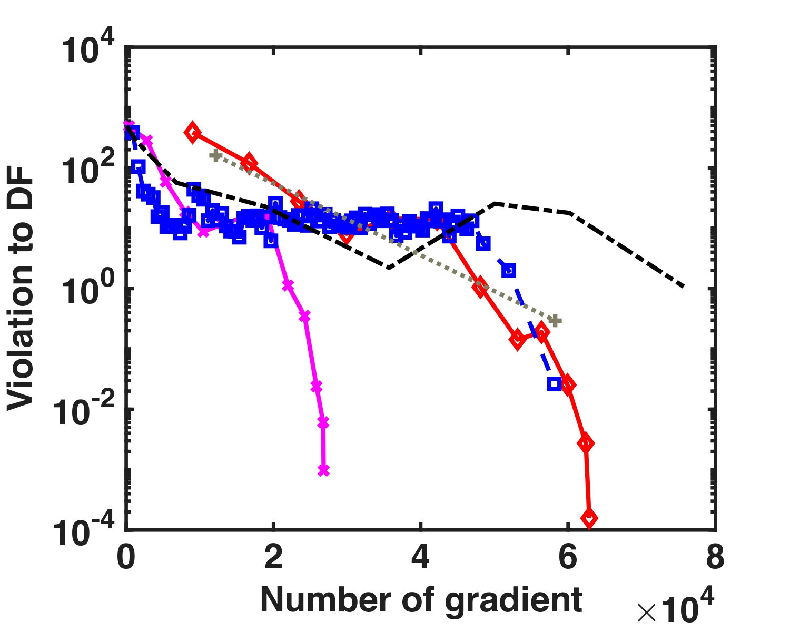
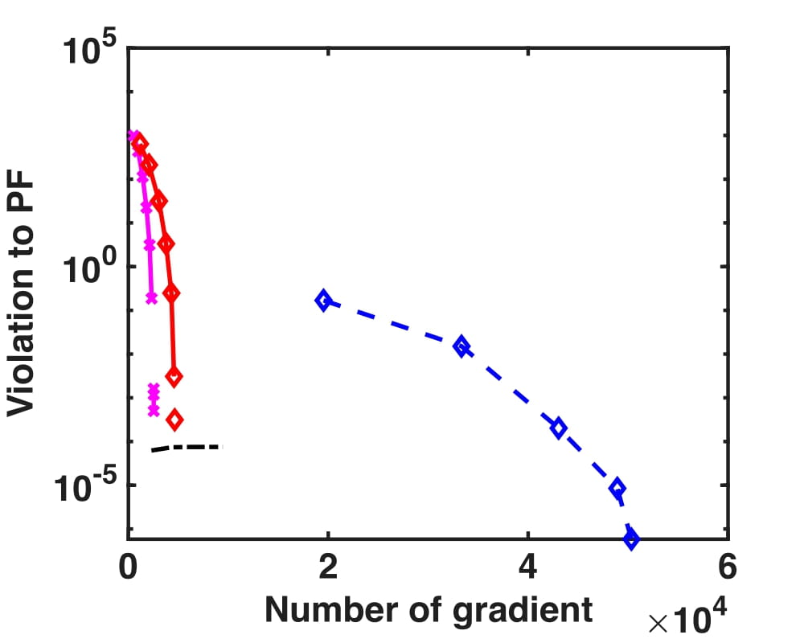
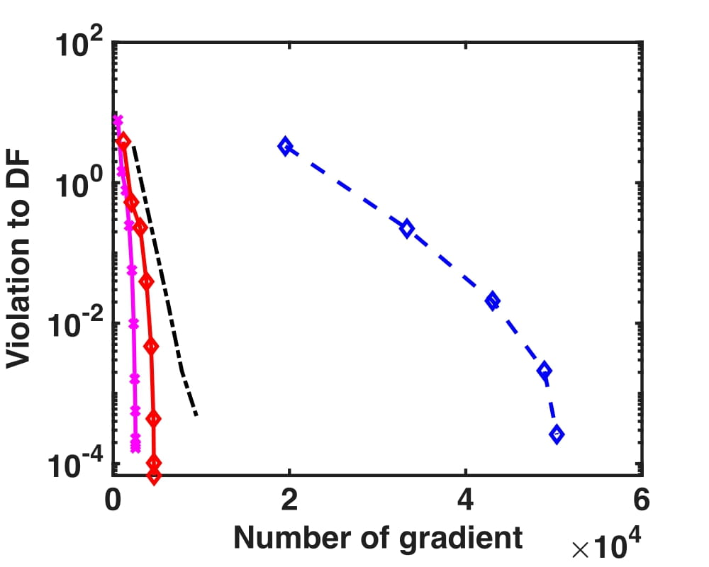

**DPALM**

This repository is the implementation of the paper: Damped Proximal Augmented Lagrangian Method for weakly-Convex Problems with Convex Constraints. [(Dahal, Wei, and Xu 2023)](https://arxiv.org/pdf/2311.09065). 

**Requirements**

Our implementation is in MATLAB 2023a. 

**Contents**

In our paper, we test our algorithm on 4 different problems: Linearly Constrained Quadratic Programming, Quadratically Constrained Quadratic Programming, Robust Nonlinear Least Squares, Classification with ROC-based fairness. In all of the problems, the objective is weakly-convex.  

The folder "LCQP" includes the main code for DPALM (our algorithm) and a testfile to run the code. This code is for section 4.2 in our paper.  

The file "QCQP" includes the main code for DPALM and a testfile to run the code. This code is for section 4.3 in our paper. 

The file "Linear Constrained NLLS" includes the main code for DPALM and a testfile to run the code. This code is for section 4.4 in our paper. 

The file "ROC_based Firness" includes the main code for DPALM, two datasets, and two testfiles to run the code. This code is for section 4.5 in our paper. 

**Usage**

For each folder which corresponds to a numerical experiment in our paper, we provide a testfile which the user can run to produce the results in the paper. 

**Performance**

On MATLAB 2023a installed on a 2017 27-inch iMac with one 3.4 GHz Quad-Core Intel Core i5 processor and 40 GB memory. 

**LCQP**

  
  

  

**QCQP**

  
  

  

**Linear Constrained Nonlinear Least Squares**

  
  

**ROC based Fairness**

  
  

  
  

**References**
1. Dahal, Hari, Wei Liu, and Yangyang Xu. "Damped proximal augmented Lagrangian method for weakly-convex problems with convex constraints." arXiv preprint arXiv:2311.09065 (2023).

**License**

See the [License](LICENSE.txt) file for license rights and limitations (MIT).

